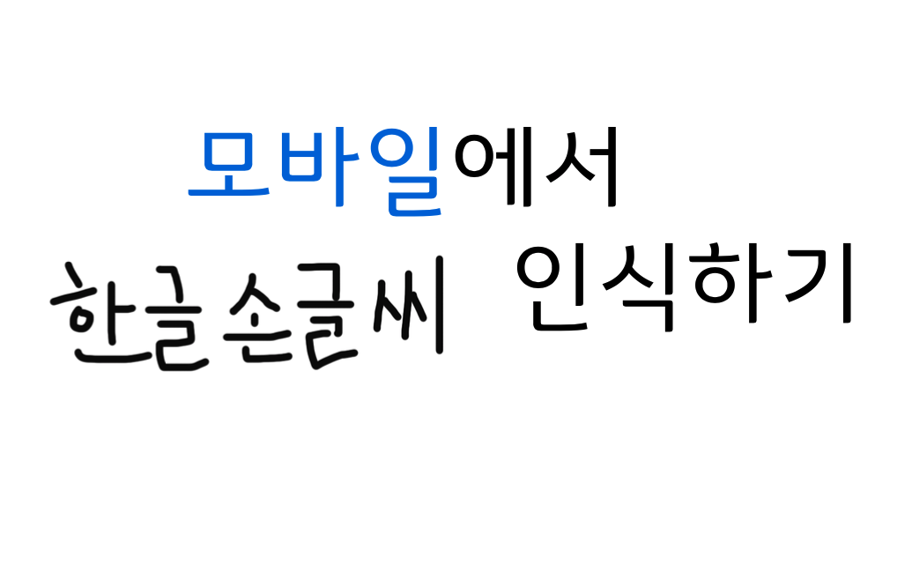
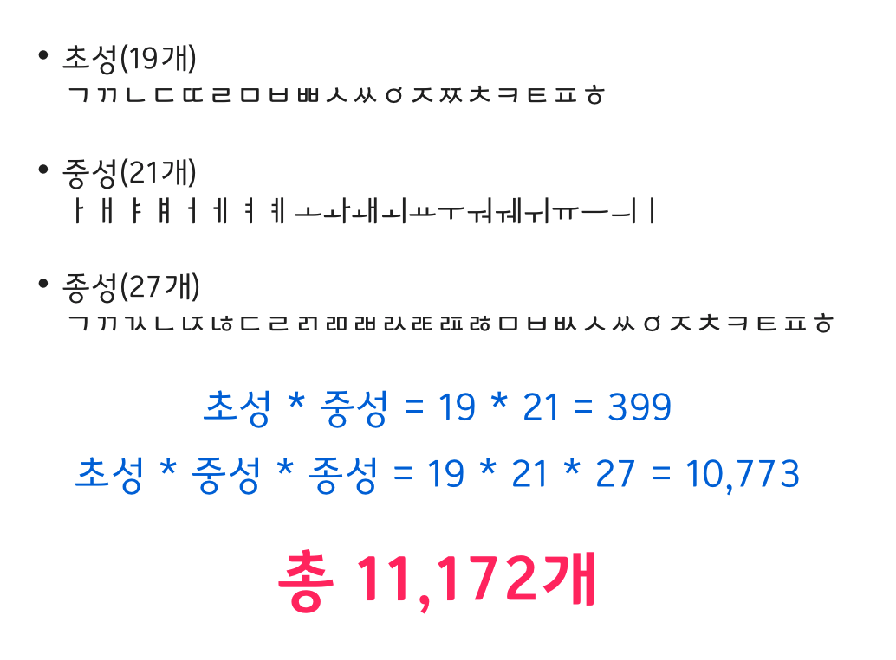
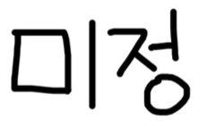

# iOS 모바일에서 한글 손글씨 인식하기(with Keras)
# Handwritten Korean Classification with Keras and CoreML


[](https://keras.io)




**너무나도 사랑하는 한글 손글씨 OCR을 시작하려 합니다.   
앞으로 어떤 모습으로 발전할지는 미정🤗이지만 이 애플리케이션으로 첫 발걸음을 내딛어보았습니다 🌱**

---

아름다운 언어인 한글은 초성 19개, 종성 21개, 그리고 중성 27개의 조합으로 총 11,172개라는 어마어마한 개수의 글자를 만들 수 있습니다 🤓



총 26개의 알파벳으로 이루어진 영어, 총 100개의 히라가나/가타카나로 이뤄진 일본어와 비교하면 어마어마한 숫자입니다. 그렇기 때문에 손글씨 데이터셋과 손글씨 예측 모델 만들기가 정말 어렵습니다. 

손글씨 데이터셋이 적고, 만들어진 모델의 인식률이 낮은 점이 아쉬워 직접 데이터를 생성하고 간단한 iOS 애플리케이션을 만들어봤습니다. 

>(English)  
>Korean has a total of 11,172 characters, why it's very difficult to create a handwritten dataset. Handwritten Korean datasets and recognition rate are less than other languages. For the high accuracy and meaningful application, I created data s and implemented a simple iOS application.

> **I want to start Korean handwriting OCR as an open source. This application is its first start 🌱**


## Dataset
```
* Image Size: 32 X 32(pixel)
* Class Number : 980
* Total Images : 46,060
```
- 개인용 또는 상업용 사용이 가능한 46개의 한글 손글씨 폰트(*.ttf)을 이용해 데이터를 생성했습니다.
- 그리고 직접 작성한 *미정 필기체*를 추가했습니다.
- TTF 파일을 이용해 이미지 데이터를 생성하는 방법은 [IBM Developer 사이트에 Paul Van Eck이 포스팅한 글](https://developer.ibm.com/kr/journey/create-a-mobile-handwritten-hangul-translation-app)을 참고했습니다.

> (English)  
- I created image data using 46 Korean handwriting fonts (* .ttf) that are available for personal or commercial use.  
- And I've added my own Mijeong Cursive.  
- For information on how to generate image data using TTF files, see [the article posted by Paul Van Eck on the IBM Developer site](https://developer.ibm.com/kr/journey/create-a-mobile-handwritten-hangul-translation-app/)

## Deeplearning Tool: Keras 🤖
```
* Keras Version: 2.2.4  
* Backend: TensorFlow 1.10.0  
```
[Keras model train in Jupyter Notebook](./train/hand_written_korean_classification_keras_train.ipynb)

- Python으로 작성된 Keras는 TensorFlow, CNTK, Theano를 내부 엔진으로 구동시키는 딥러닝 High-level API입니다.  
 
## CoreMLTools 📲
```
* Version: 2.1.0  
```
- Python 패키지인 CoreMLTool을 이용해 Keras로 생성된 모델을 CoreML 모델로 변환합니다.  

>- Python pachage   
- Convert Keras model to CoreML model

## CoreML 💾
[hand_written_korean_classification.mlmodel](./model/hand_written_korean_classification.mlmodel)

-  Apple에서 제공하는 머신러닝 프레임워크 입니다. iOS11부터 사용 가능합니다. 

>- Apple framework for Machine Learning
- From iOS11

## Author :octocat:
  
Mijeong Jeon   
ninevincentg@gmail.com


**조금 더 알고싶다면 아래 슬라이드를 참고해주세요 🕊**  
[💻 슬라이드 쉐어 바로가기](https://www.slideshare.net/MijeongJeon1/ios-with-keras)